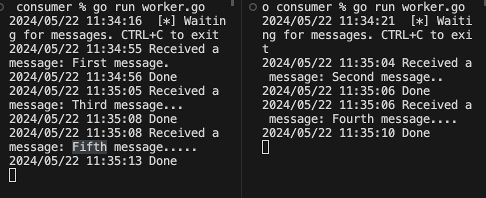
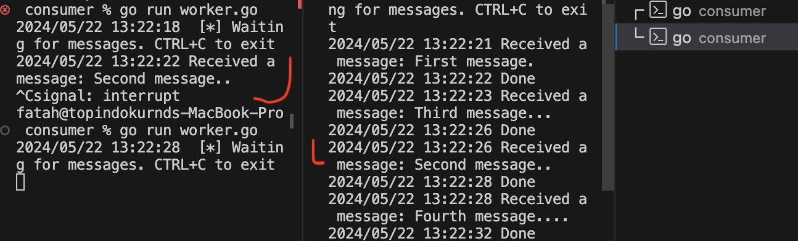

Ref: [Rabbit MQ tutorial 2 GO](https://www.rabbitmq.com/tutorials/tutorial-two-go)

# Notes

Below are just some of my notes taken from the ref and some result of experiment

## Introduction

This worker queue can easily be scale up, by running more worker, examples below by running to shell:



So how does it work, in the worker code we put the "." character to count how long we sleep the worker (pretending it is busy) by doing that we can see that each running instance of the worker can process queues in parallel. 

> By default, RabbitMQ will send each message to the next consumer, in sequence. On average every consumer will get the same number of messages. This way of distributing messages is called round-robin. Try this out with three or more workers.

Example for running the publisher:

```bash
go run new_task.go First message.
go run new_task.go Second message..
go run new_task.go Third message...
go run new_task.go Fourth message....
go run new_task.go Fifth message.....
```

## Message acknowledgment

> Doing a task can take a few seconds, you may wonder what happens if a consumer starts a long task and it terminates before it completes. With our current code, once RabbitMQ delivers a message to the consumer, it immediately marks it for deletion. In this case, if you terminate a worker, the message it was just processing is lost. The messages that were dispatched to this particular worker but were not yet handled are also lost.

> But we don't want to lose any tasks. If a worker dies, we'd like the task to be delivered to another worker.

In summary we can set the auto-ack when consuming the channel to false so we can manage the acknowledgment manually (in worker.go on line 49, and line 56)

DON'T forget to use ack method if use it manually

> It's a common mistake to miss the `ack`. It's an easy error, but the consequences are serious. Messages will be redelivered when your client quits (which may look like random redelivery), but RabbitMQ will eat more and more memory as it won't be able to release any unacked messages.

> In order to debug this kind of mistake you can use `rabbitmqctl` to print the `messages_unacknowledged` field:

```bash
sudo rabbitmqctl list_queues name messages_ready messages_unacknowledged
```

Or windows:

```shell
rabbitmqctl.bat list_queues name messages_ready messages_unacknowledged
```

Here is some example stopped worker with CTRL+C



> If a consumer dies (its channel is closed, connection is closed, or TCP connection is lost) without sending an ack, RabbitMQ will understand that a message wasn't processed fully and will re-queue it. If there are other consumers online at the same time, it will then quickly redeliver it to another consumer. That way you can be sure that no message is lost, even if the workers occasionally die.

## Message Durability

If the rabbitMQ server crash then the task will be lost so the solution is 

- by setting "true" on durable parameter in ch.QueueDeclare() (on publisher in file new_task.go on line 38, and customer in worker.go on line 28)

Make sure that the queue declare by publisher is a NEW queue, queue that has been declared before will return error if the parameter is different


- other option is by using the `amqp.Persistent` option `amqp.Publishing` takes.

```go
err = ch.PublishWithContext(ctx,
  "",           // exchange
  q.Name,       // routing key
  false,        // mandatory
  false,
  amqp.Publishing {
    DeliveryMode: amqp.Persistent,
    ContentType:  "text/plain",
    Body:         []byte(body),
})
```

## Fair dispatch

> ...one worker will be constantly busy and the other one will do hardly any work. Well, RabbitMQ doesn't know anything about that and will still dispatch messages evenly.
>
> This happens because RabbitMQ just dispatches a message when the message enters the queue. It doesn't look at the number of unacknowledged messages for a consumer. It just blindly dispatches every n-th message to the n-th consumer.

We can set prefetch to 1 so the worker can only process one message at a time. (example in consumer/worker.go on line 39)

> Or, in other words, don't dispatch a new message to a worker until it has processed and acknowledged the previous one. Instead, it will dispatch it to the next worker that is not still busy.

!A bit note if all worker are busy queue can fill up so we have to look out for it, maybe adding more workers, or using other strategy.
